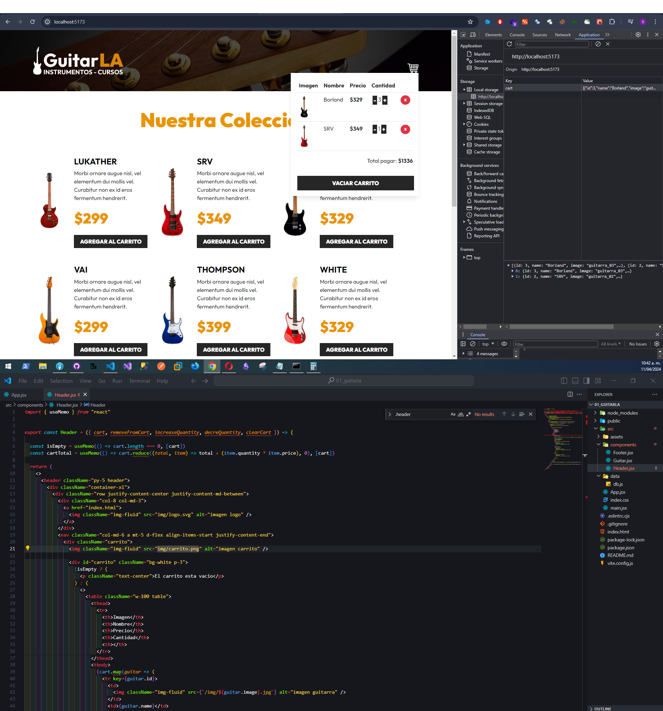

# React + Vite GuitarLA

Aplicación en React de carrito de compras, se uso el useState, useMemo, LocalStorage y JSX eliminar elementos, añadir guitarras eliminar y vaciar el carrito de compras.

Link: https://lustrous-froyo-be6c02.netlify.app/

