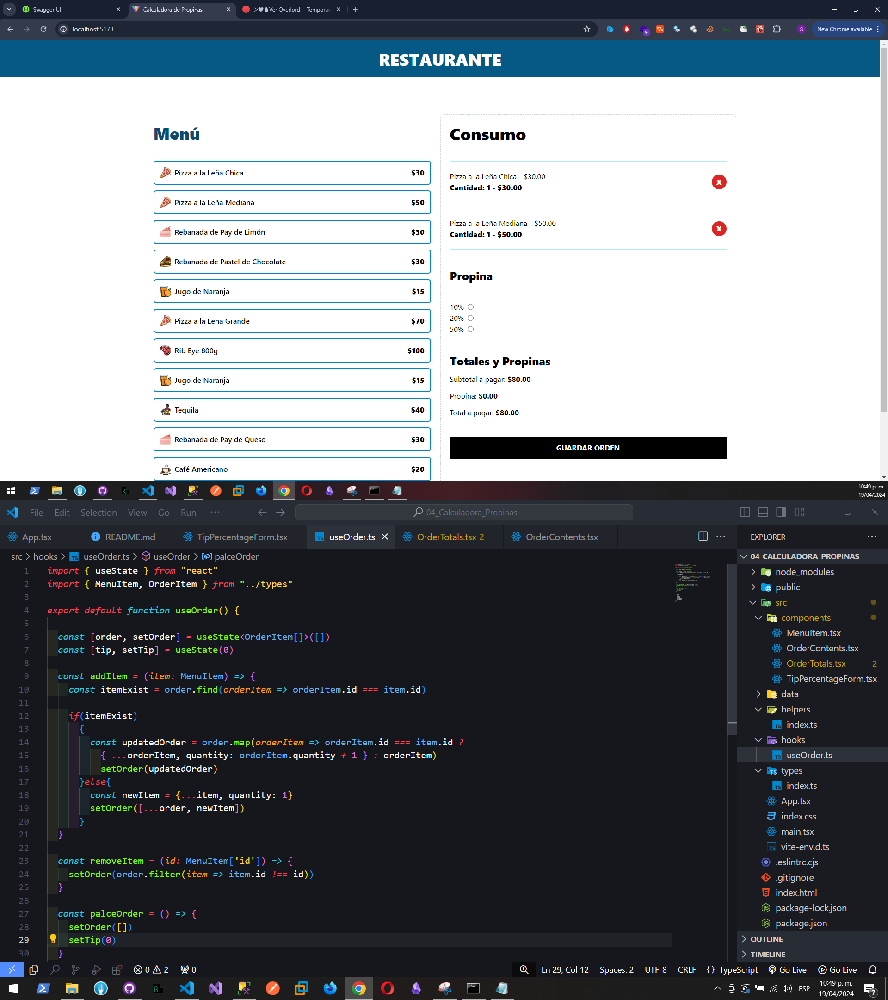

# Buscador de Gif

Hecho en React + Vite y JS

Buscador de gif que consume la api de GIPHY Developers.
Uso de useState, useEffect.
Consumo de la API de GIPHY de gifs.
Se creo un hook personalizado llamado useFetchGifs donde hace el llamado a la API.

Link de la web final: https://660214ee829f00708fc64988--friendly-strudel-78c0c6.netlify.app/

