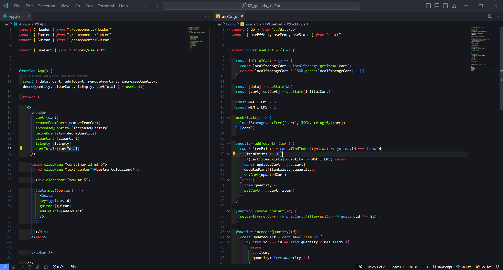

# Calculadora de propinas

Link: https://65faf0a95a15861a4a05676b--dashing-stroopwafel-608aa7.netlify.app/

Herramienta que permite calcular propinas segun la orden que el usuario escoja, hace la suma total de la orden saca el porcentaje de la propina y realiza la suma.
Se uso React + TypeScript con Vite, se realizo un Custom Hook.
Se uso useMemo, useEfect, TailwindCSS y mucho más.