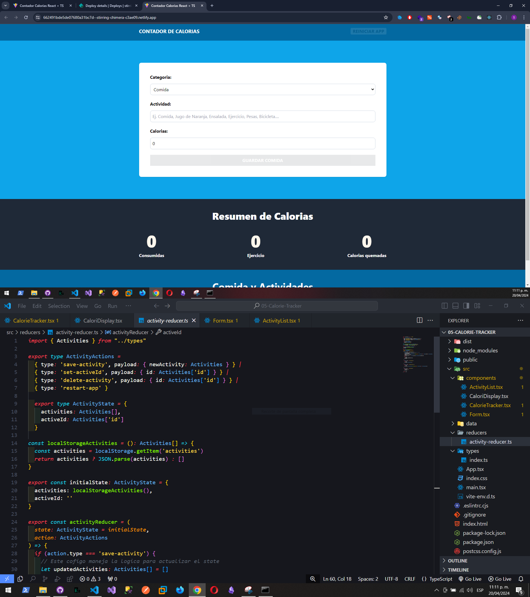

# Contador de Calorias

Aplicación hecha con React + TypeScript + TailwindCSS + LocalStorage

En especial se uso el useReducer para "centralizar" el llamado de la logica

Link: https://662491bde5de07680a31bc7d--stirring-chimera-c3ae09.netlify.app/

