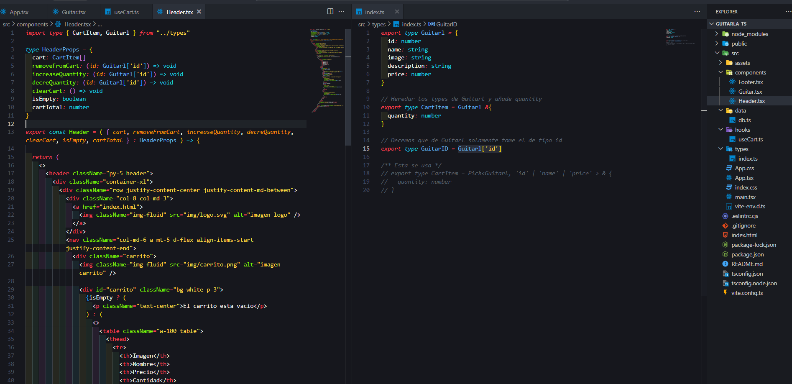

# Proyecto Contador de Calorias

Hecho en React + Vite y TailwindCSS

Se hicieron 4 componentes un archivo que simula ser una BD.
Interfaces o Types.
Un archivo reducer.
Se almaceno en localStorage para manterner la data "persistente"

Link del proyecto: https://6601ae421d391a17ac434550--zingy-meerkat-aed8d4.netlify.app/

