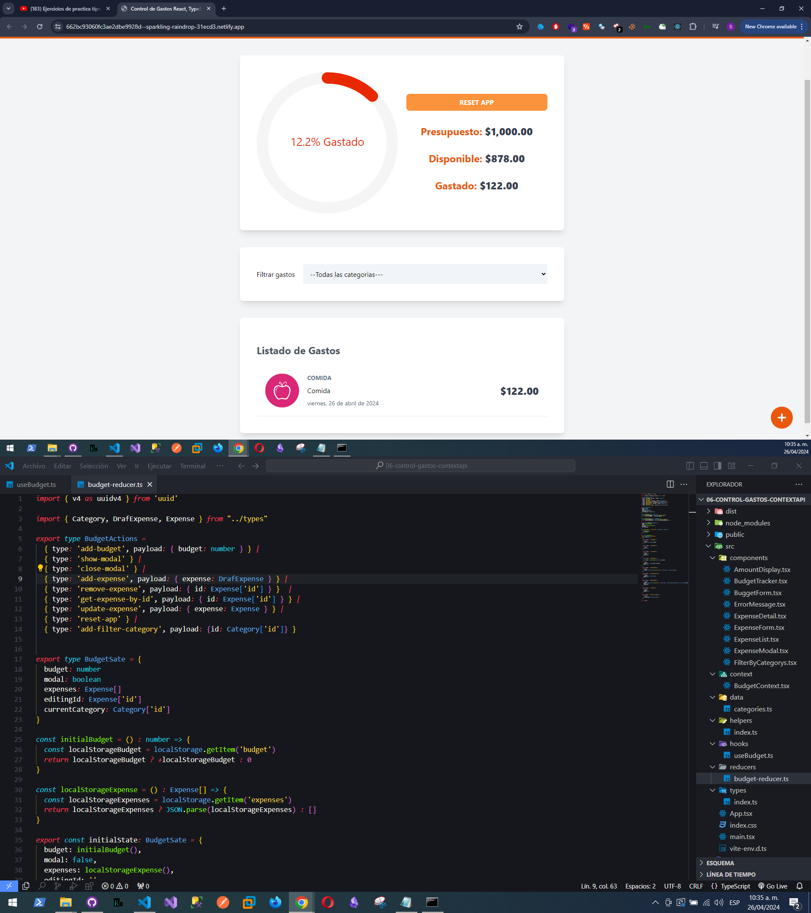

# Planificador de Gastos en React + Vite + TypeScript

Se uso Context Api, useReducer para pasar toda la información desde el context.

Se uso Handless UI para la ventana modal.

Link: https://662bc93060fc3ae2dbe9928d--sparkling-raindrop-31ecd3.netlify.app/

Se agrego un calendario 'react-date-picker' de nmpjs.com
https://www.npmjs.com/package/react-date-picker

Se uso la libreria react-swipeable-list para el efecto de eliminar o actualizar de swipe
https://www.npmjs.com/package/react-swipeable-list

