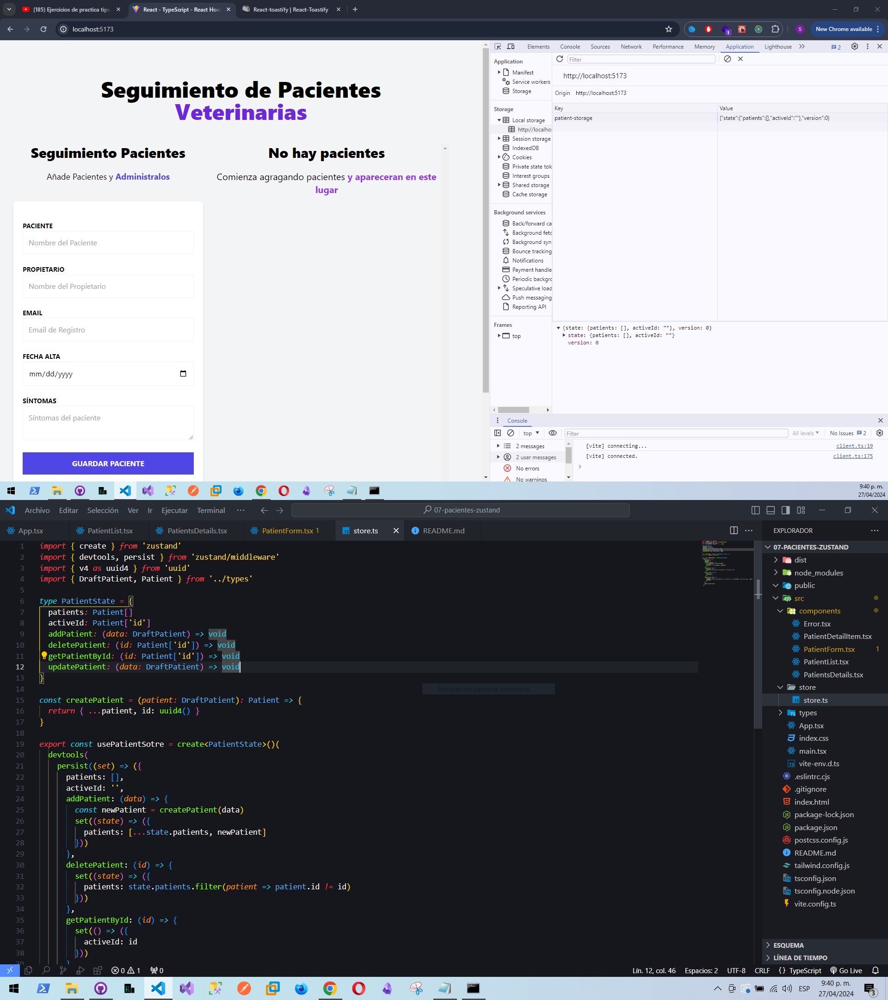

# React + TypeScript + Vite + TailwindCSS + Zuntand + React-Toastify

Proyecto hecho con Zuntand para manejar un estado global. 
Se uso la librerial React-Toastify para mostrar las alertas de guardado, actualizado y eliminado,

Link: https://662db65fb911215afb57cf5c--dulcet-douhua-39bcb2.netlify.app/

