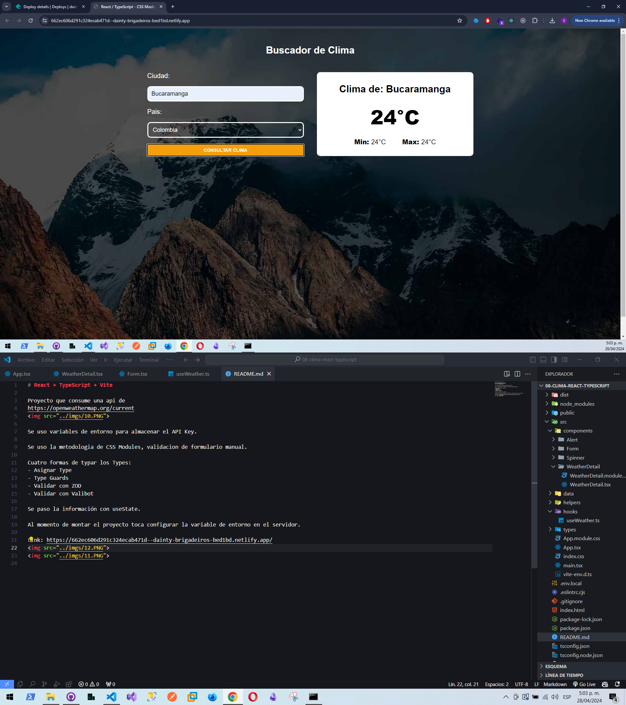

# React + TypeScript + Vite

Proyecto que consume una api de 
https://openweathermap.org/current

Se uso variables de entorno para almacenar el API Key.

Se uso la metodologia de CSS Modules, validacion de formulario manual.

Cuatro formas de typar los Types:
- Asignar Type
- Type Guards
- Validar con ZOD
- Validar con Valibot

Se paso la información con useState.

Al momento de montar el proyecto toca configurar la variable de entorno en el servidor.

Link: https://662ec606d291c324ecab471d--dainty-brigadeiros-bed1bd.netlify.app/

