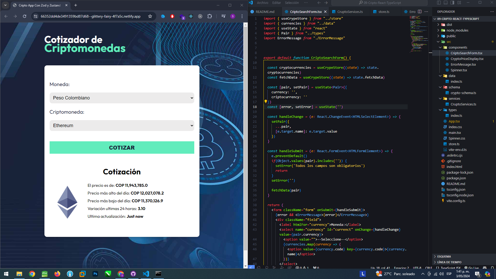

# Aplicación De Criptomonedas

Consumimos una API de Criptos.
CSS module.
Para darle sombra al borde del cuadro se uso:
https://getcssscan.com/css-box-shadow-examples

Se uso Axios, ZOD y Zustand

Link:https://66352dd4de3491359bd87d68--glittery-fairy-4f7a5c.netlify.app/

Proyecto finalizado