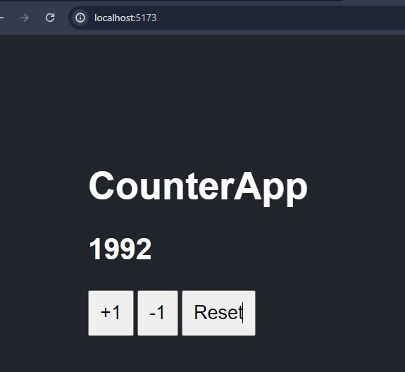

# Yarn + Vite

Proyecto creado con Yarn + Vite

Para aprender el funcionamiento del useState.
Carpetas que conforman React.
Creación de componentes, pasar parametros por compenentes.

Se realizo pruebas Testing a archivos .js con jestjs

